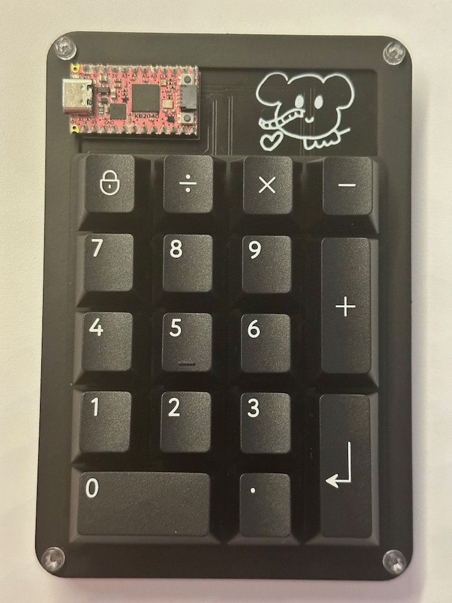

# Elephant Keyboard
USB-C Number Pad Mechanical Keyboard

Featuring hot-swap Kailh sockets and RGB LED lighting.

Based on [Adafruit KB2040](https://www.adafruit.com/product/5302)

Keyboard Layout
---------------

Number pad from [Keyboard Layout Editor](http://www.keyboard-layout-editor.com)

```
["Num Lock","/","*","-"],
[{a:4,f:3},"7\nHome","8\n↑","9\nPgUp",{h:2},"+"],
["4\n←","5","6\n→"],
["1\nEnd","2\n↓","3\nPgDn",{h:2},"Enter"],
[{w:2},"0\nIns",".\nDel"]
```

Panel from [Swill Plate & Case Builder](http://builder.swillkb.com)

Options:
* mx t3
* cherry only
* edge padding 2.5mm
* corners 2.5mm

Firmware
--------

Based on [KMK](https://github.com/KMKfw/kmk_firmware)

With the following CircuitPython versions:

```
adafruit-circuitpython-adafruit_kb2040-en_GB-7.3.3.uf2
adafruit-circuitpython-bundle-7.x-mpy-20230129.zip
```

And these library files in `lib`:

```
adafruit_pixelbuf.mpy
neopixel.mpy
```

Parts
-----

* 0805 500R resistor QTY 1 (YAGEO RC0805JR-07470RL)
* 0805 100nF capacitor QTY 18 (YAGEO CC0805KRX7R9BB104)
* SC-70-5 level shifter buffer QTY 1 (TI SN74LV1T34DCKR)
* SOD-123 diode QTY 17 (ST 1N4148W)
* Kailh hot-swap sockets QTY 17 (CPG151101S11) [AdaFruit](https://www.adafruit.com/product/4958)
* Neopixel LEDs QTY 17 (SK6812MINI-E) [AdaFruit](https://www.adafruit.com/product/4960)

Plus KB2040 and any mechanical pieces for case i.e. bumpers (3M SJ-5312) and user choice of key caps and switches etc.

Panel was laser cut and powder coated 0.063" 5052 Aluminium by [SendCutSend](https://sendcutsend.com)

Other case parts laser cut 0.118" Acrylic, 0.030" chipboard and powder coated 0.063" 5052 Aluminium.

And finally 12mm M3 nylon or plastic nuts and bolts.

Build
-----


License Information
-------------------
The hardware is released under [Creative Commons ShareAlike 4.0 International](https://creativecommons.org/licenses/by-sa/4.0/).

Distributed as-is; no warranty is given.
